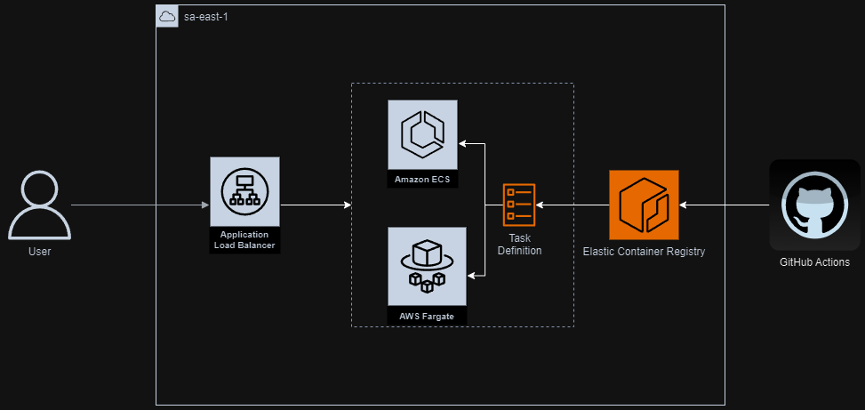

# Backend challenge

Backend challenge é um projeto em Java usando Spring Boot que implementa um serviço REST para validações de tokens JWT.

## Sobre o serviço

Este serviço REST fornece um conjunto de endpoints para validar o formato e a estrutura de um token JWT. Com a aplicação rodando adequadamente, você pode chamar os endpoints definidos na documentação abaixo.


Esta aplicação expõe um endpoint de health check em ```{{baseUrl}}/actuator/health``` (disponível na **porta 8080**) para monitoramento. Conta também com as bibliotecas SL4j e Micrometer para logging e tracing.

O serviço é coberto por testes usando JUnit, Mockito e MockMvc.

## Pré-requisitos

- Java 21
- Maven 4.0.0
- OU Docker
- Terraform 1.9.7 e AWS CLI (Se desejar subir a infra na AWS)

## Executando a aplicação localmente

- Use o comando `docker-compose up` para subir a aplicação usando o docker.
- Use o comando `mvn clean install` para buildar e `mvn spring-boot:run` para subir a aplicação usando o maven.


## Arquitetura



## Descrição dos métodos

### Método: `TokenValidationController.validateJwtToken`
- **Descrição**: Recebe requisições e processa a validação do token JWT.
- **Fluxo**:
    1. **Recepção do Token**: O método `validateJwtToken` é invocado com o token JWT extraído do corpo da requisição.
    2. **Validação do Token**:
        - O método chama `TokenService.validateToken` para iniciar o processo de validação.
        - Dentro do `TokenService`, a biblioteca `jjwt` é utilizada para decodificar o token.
        - Após a decodificação, o método `ClaimValidator.validate()` é chamado para validar as claims do token.
    3. **Tratamento de Exceções**:
        - Se ocorrer uma falha na decodificação do token, uma `JWTDecodeException` é lançada.
        - Se a validação das claims falhar, uma `ClaimValidationException` é lançada.
    4. **Gerenciamento de Erros**:
        - As exceções lançadas são capturadas pelo `GlobalControllerExceptionHandler`.
        - O `GlobalControllerExceptionHandler` retorna:
            - **Status 400**: Se houve erro na decodificação do token.
            - **Status 412**: Se houve erro na validação das claims.
    5. **Resposta de Sucesso**:
        - Se tanto a decodificação quanto a validação das claims forem bem-sucedidas, o método retorna status **201**.

## Exceções
- **JWTDecodeException**: Lançada quando a decodificação do token falha.
- **ClaimValidationException**: Lançada quando as regras de validação das claims não são atendidas.

## Documentação da API

A API é documentada usando OpenAPI 3 specification. A definição pode ser acessada em:

- Endpoint: `/v3/api-docs`
- Arquivo: `backend-challenge-api-docs.yaml` localizado na pasta `resources`. Este arquivo é gerado durante o build da aplicação.

A definição é feita por abstrações da biblioteca do springdoc e também por declarações explícitas nos controllers, exception handlers e na classe OpenAPIConfig.

## Bruno Collection

- Você pode importar  a pasta `./bruno/backend-challenge-apis` no seu Bruno API Client para testar as requisições deste serviço.

# Workflow

### Deploy to Amazon ECS with Fargate

Este workflow do GitHub Actions é projetado para automatizar o processo de deploy da aplicação em um cluster do Amazon ECS (Elastic Container Service) utilizando Fargate. A aplicação é disponibilizada através de um Application Load Balancer. Este workflow é chamado sempre que há um push para a branch master.

# Provisionamento através de código

### Recursos

A pasta terraform contém declarações dos módulos necessários para criar a infraestrutura na AWS. Os recursos a serem criados são:
 - IAM Roles and policies
 - VPC, Subnets, Internet Gateway and Route Tables
 - Security Groups
 - Application Load Balancer
 - ECR
 - ECS
 - Fargate Task Definition

### Setup

Para executar o provisionamento, certifique-se de estar logado na AWS CLI e, nos comandos que envolvem o terraform, também certifique-se de inserir as credenciais da AWS nos arquivos `terraform.tfvars`

### Provisionamento ECR

Para começar, navegue até a pasta ./terraform/ecr e execute os seguintes comandos:
- `terraform init` (Instala os providers)
- `terraform plan` (Faz a revisão dos recursos a serem criados)
- `terraform apply` (Provisiona os módulos declarados)

Coloque a URI do ECR criado na variável 'image_url' do arquivo `./terraform/ecs/variables.tf`

Antes do próximo passo, precisamos subir uma imagem docker no ECR que foi provisionado. Substitua corretamente com os campos <sua-região> e <seu-id-da-conta>:
 - `aws ecr get-login-password --region <sua-região> | docker login --username AWS --password-stdin <seu-id-da-conta>.dkr.ecr.<sua-região>.amazonaws.com`
 - `docker build -t backend-challenge:latest .`
 - `docker tag backend-challenge:latest <seu-id-da-conta>.dkr.ecr.<sua-região>.amazonaws.com/backend-challenge-container:latest`
 - `docker push <seu-id-da-conta>.dkr.ecr.<sua-região>.amazonaws.com/backend-challenge-container:latest`

### Provisionamento ECS

Finalmente, navegue até a pasta ./terraform/ecs e execute os seguintes comandos:
- `terraform init` (Instala os providers)
- `terraform plan` (Faz a revisão dos recursos a serem criados)
- `terraform apply` (Provisiona os módulos declarados)

Os recursos deverão estar provisionados na sua conta da AWS. Para acessar a API, procure pelo load balancer que foi criado e use o DNS público como host.

# Contato

Para mais informações, entre em contato com [gabriel.hamartins@gmail.com](mailto:gabriel.hamartins@gmail.com).